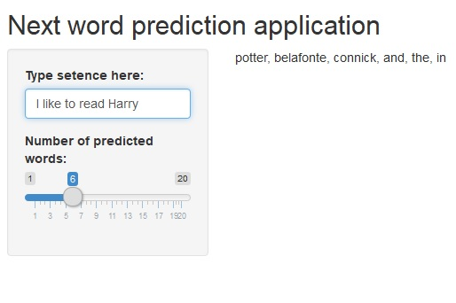

```{r setup, include=FALSE}
knitr::opts_chunk$set(echo = FALSE)
```

## About the application

 </br>
This [application](https://roachchang.shinyapps.io/NextWordPredictionApplication/) is simple, just type text in and you can get the predicted words. <br>
You can use the silder to adjust the number of words you want to predict.

## Details

- Random seed was set as 2019.
- I took 1/10 of original text data because of hardware limit.
- International words such as hashtag, urls and e-mail address were removed.
- Combined [modified Kneser-Ney smoothing](https://en.wikipedia.org/wiki/Kneser%E2%80%93Ney_smoothing) and [Markov Chains](https://en.wikipedia.org/wiki/Markov_chain) to do 1-4 gram next word prediction.
